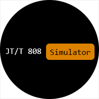

<div align="center">
	
</div>

## jtt808-simulator
本项目为 **JT/T808部标协议** 终端模拟程序，通过模拟正常车辆的行驶轨迹、停留、报警触发等，可达到部标服务器的压力测试，以及业务数据处理（区域驶入驶出、超速、超时行驶等）的要求。后续还会继续加入 **JT/T 1078** 实时音视频等功能特性。最终目标是让模拟器更加可控，更加逼真。

> 注意：本项目正处于开发中，尚有很多不完善的地方，请谨慎使用。
> 另外，本项目直接使用百度地图所产生的坐标做行驶轨迹的模拟，所以在平台端再显示到地图上时，需要注册坐标系问题。

## 特性
- [x] 本项目使用 **SpringBoot** 、 **MyBatis** 、 **H2文件数据库**。
- [x] **并发连接控制**，使用 **netty** 作为终端连接到服务器端的连接管理，目标是10万辆车在线。
- [ ] **协议版本**，暂时只支持 **JT/T 808 2013** 版本，后续再加入 **JT/T 808 2019** 版的支持。
- [ ] **参数配置**，现在提供的配置参数还比较少，只是必需的几个，后续会加入 **0x8103** 指令所支持的绝大部分参数的动态获取与设置。
- [ ] **协议交互日志**，在调试模式下，记录每辆模拟车辆与服务器端交互的所有消息记录，便于联调测试。
- [x] **轨迹模拟**，通过百度地图API来规划行驶路线，在每次行驶前，都会随机化轨迹，以确保每一次走的都是同路但不同点。
- [ ] **车辆实时交互**，实时调阅模拟车辆的所有参数、查询状态，并且能够手动触发报警等。
- [ ] **JT/T 1078音视频传输支持**，模拟视频终端，便于音视频的服务器端联调与开发。

> 注意：目前使用的是JT/T808 2013版的协议，并且是按照5秒的时间间隔发送位置消息。

## 使用指南
### 线路管理
创建一条行驶线路，用于车辆模拟运行时的位置上报的轨迹点模拟，模拟车辆在行驶时，将会随机化轨迹点，确保每一次行驶时的轨迹点都不一样。创建线路时，可以设置行驶的最高、最低行驶速度，以及停留点，报警事件（尚未实现）等。

### 行程任务
通过已经创建好的线路，创建临时的行驶行程任务，目前要填写的项多达五项（车牌号、终端ID、SIM卡号、服务器IP与端口），后面会简化并提供批量创建的功能用于压力测试。

### 实时监控
暂未实现，后续补充。

## 扩展开发指南
### 结构
待补充

### 流程
待补充

### 接口
通过继承`AbstractDriveTask`实现的`SimpleDriveTask`，是一个简易的终端模拟控制程序，项目使用 **EventLoop** 思路实现多线程多任务的处理流程管理，主要分为以下两大类： **事件回调** 与 **定时/延时任务** 。

#### 事件回调
##### 1. 事件分类

定义于 `EventEnum` 类中，主要是TCP连接状态和服务器端消息，细分如下：

- [ ] data_received：收到数据时
- [ ] data_sent：数据发送时
- [x] connected：连接建立成功时
- [x] disconnected：连接断开时
- [ ] send_failed：发送失败时
- [x] message_received：收到服务器端消息时
- [ ] message_sent：消息发送成功时
- [ ] message_ignored：服务器端消息被忽略时，即收到了不支持的消息时触发
- [ ] user_interact：用户触发

> 上面的事件分类，只实现了三个，但是已经满足了绝大部分场合的需求，其它未实现的，有没有用都还不确定 ，有可能会在后续的实现过程中删除掉。

##### 2. 事件的触发与执行调度
事件可能由多种条件触发，最终统一交由 **EventDispatcher** 进行调度，并由 **LoopRunner** 进行执行。特别需要注意的是，服务器端发送过来的消息，有特别的路由机制，因为主动下发的消息指令很多，不可能一一定义，所以我定义了以下的注解，用于对事件的进一步细节，如普通事件 **connected** 的监听如下代码：

```java
@Listen(when = EventEnum.connected)
public void onConnected()
{
	// to do something when connected to server
}
```

但是像 **message_received** 事件，如果由开发者另行路由，就有点太臃肿了，所以我为 `@Listen` 注解增加了 **attachment** 参数，用于进一步细分，如监听 **0x8801** 摄像头立即拍摄命令，可按以下方式实现：

```java
@Listen(when = EventEnum.message_received, attachment = "8801")
public void onCameraCaptureCommand(JTT808Message msg)
{
	// 完成抓拍并发送到服务器端的过程
    // 注意，上面的方法名称没有要求，随便命名即可，attachment的值要是消息ID。
}
```

##### 3. 事件触发后的回调处理
因为在分派 **LoopRunner** 时，是按照 **AbstractDriveTask** 的 **hashcode** 进行分配线程，所以每一个 **AbstractDriveTask** 的方法，除了 **init()** 和 **startup** 方法外，都是在同一个线程之中（包括定时/延时任务），大可不必担心线程安全问题。

#### 定时/延时任务
目前提供了定时/延时任务的API，定时/延时任务的执行，也是由 **LoopRunner** 线程运行，它与上一章节的事件执行处于同一个线程之中，不需要关心线程安全问题，方法原型定义如下：

```java
// 延时任务
/**
 * 在milliseconds毫秒后执行Exectable
 * @param executable 需要执行的任务
 * @param milliseconds 等待的毫秒
 */

public final void executeAfter(Executable executable, int milliseconds);

// 定时重复执行的任务
/**
 * 按照interval毫秒的间隔执行Exectable
 * @param executable 需要执行的任务
 * @param interval 间隔时间，单位毫秒
 */

public final void executeConstantly(Executable executable, int interval);

```

## 后记